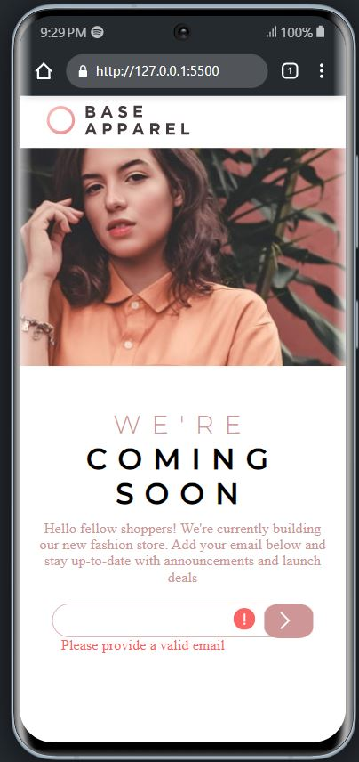

# Frontend Mentor - Base Apparel coming soon page solution

This is a solution to the [Base Apparel coming soon page challenge on Frontend Mentor](https://www.frontendmentor.io/challenges/base-apparel-coming-soon-page-5d46b47f8db8a7063f9331a0). Frontend Mentor challenges help you improve your coding skills by building realistic projects. 

## Table of contents

- [Frontend Mentor - Base Apparel coming soon page solution](#frontend-mentor---base-apparel-coming-soon-page-solution)
  - [Table of contents](#table-of-contents)
  - [Overview](#overview)
    - [The challenge](#the-challenge)
    - [Screenshot](#screenshot)
    - [Links](#links)
  - [My process](#my-process)
    - [Built with](#built-with)
    - [What I learned](#what-i-learned)
  - [Author](#author)


## Overview

### The challenge

Users should be able to:

- View the optimal layout for the site depending on their device's screen size
- See hover states for all interactive elements on the page
- Receive an error message when the `form` is submitted if:
  - The `input` field is empty
  - The email address is not formatted correctly

### Screenshot





### Links


- [Click here to get the solution](https://github.com/Titus210/Front-end-mentor/tree/master/Base_Apparel)
- [The website is hosted here](https://jocular-crostata-1ee54f.netlify.app/)

## My process

### Built with

- Semantic HTML5 markup
- CSS custom properties
- Flexbox
- CSS Grid
- Mobile-first workflow
- [Styled Components](https://styled-components.com/) - For styles


### What I learned
Getting element using event listeners and checking its input using regex validity
```
   var errorMessage = document.getElementById("error");
    var errorIcon = document.getElementById("warning-icon")

    if (!isEmailValid) {
        errorMessage.style.display = "block";
        errorIcon.style.display = "block";
    }
```

## Author

- Linkedin: [Titus Kiplagat](https://www.linkedin.com/in/titus-kiplagat-5146ba210/)
- Frontend Mentor - [@Titus210](https://www.frontendmentor.io/profile/Titus210)
