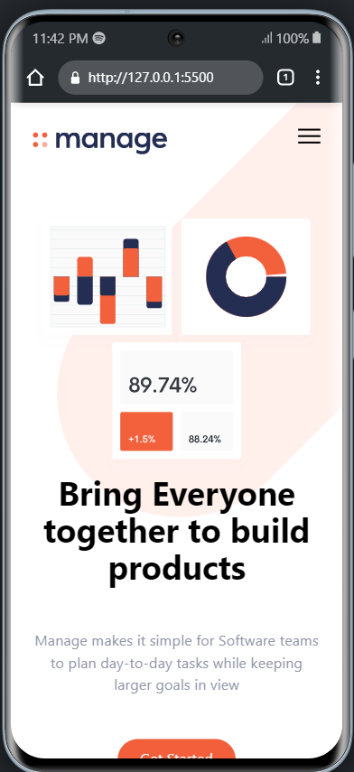

# Manage: Project Management Software Tool
***

## Overview
This project is a website called Manage that helps manage projects. Users can create, edit, and delete projects as well as add tasks to each project. The website is built using HTML, CSS, JavaScript, and Tailwind CSS.

## The Challenge
The challenge of this project was to create a project management website that is user-friendly and visually appealing. The website needed to be responsive, accessible, and functional.

## Screenshot



## Link

## How to setup
To set up the Manage website on your local machine, follow these steps:
1. Clone the repository to your local machine using the command:
```
git clone https://github.com/your-username/your-repo-name.git
```
2. Open the cloned folder in your code editor.
3. Open the index.html file in your browser to see the website.

## My Process
I followed a tutorial by Traversy Media to build this project. The tutorial was a great resource for learning how to use Tailwind CSS and how to build a project management website.
## Build With
- HTML
- CSS
- Javascript
- Tailwindcss

## What I Learned
During this project, I learned how to use Tailwind CSS to quickly style the website. I also learned how to use JavaScript to manipulate the DOM and create interactive elements on the website.

## Continued Development
In the future, I would like to add more features to the website, such as the ability to assign tasks to specific users and to set deadlines for tasks. I would also like to improve the accessibility of the website.

## Useful resources
[Tailwind Css Documentation](https://tailwindcss.com/docs)
[Javascript DOM manipulation](https://www.w3schools.com/js/js_dom_intro.asp)

## Author
- Name: Titus Kiplagat
- [Github](https://github.com/Titus210)
- [LinkedIn](https://www.linkedin.com/in/titus-kiplagat-5146ba210/)

## Acknowledgements
I would like to thank Traversy Media for providing the tutorial that helped me build this project.

## License
This project is licensed under the [MIT License](https://opensource.org/licenses/MIT)