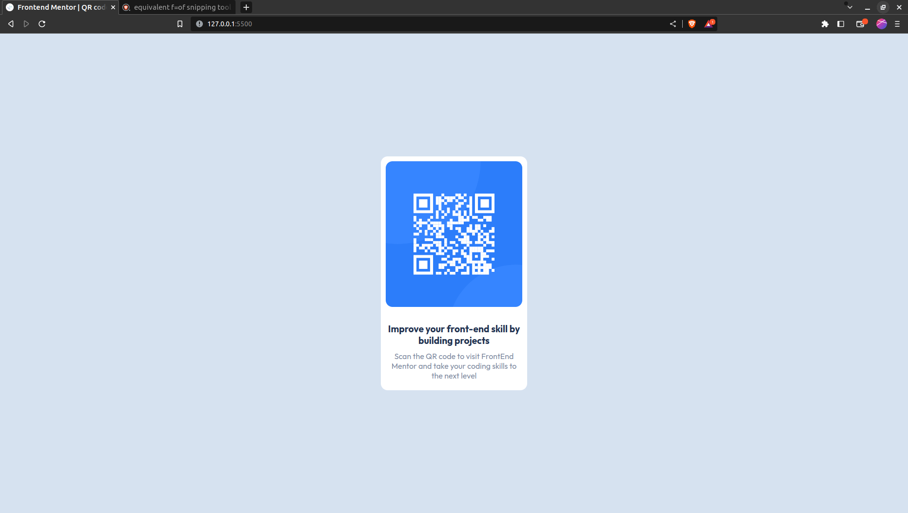

# Frontend Mentor - QR code component solution

This is a solution to the [QR code component challenge on Frontend Mentor](https://www.frontendmentor.io/challenges/qr-code-component-iux_sIO_H). Frontend Mentor challenges help you improve your coding skills by building realistic projects. 

## Table of contents

- [Overview](#overview)
  - [Screenshot](#screenshot)
  - [Links](#links)
- [My process](#my-process)
  - [Built with](#built-with)
   - [Continued development](#continued-development)
 - [Author](#author)

## Overview
This is a coded solution for the Front end mentor qrcode component, its a responsive test to improve skills in design, use of 
### Screenshot

This is the Final solution screenshot

### Links

- [Live Site URL](https://646cee3857921643b8c26369--radiant-babka-d4f6f5.netlify.app/)
- [Solution URL](https://github.com/Titus210/Front-end-mentor/tree/master/Qr%20Card)

## My process

### Built with

- Semantic HTML5 markup
- CSS custom properties
- Flexbox
- CSS Grid
- Mobile-first workflow

### Continued development

In continued development, i am currently working on more difficult projects that i come across mostly from frontend mentor and other web development related sites

## Author

- Frontend Mentor - [Titus210](https://www.frontendmentor.io/profile/Titus210)
- Twitter - [@Tittoh_code](https://twitter.com/_tittoh_code)
